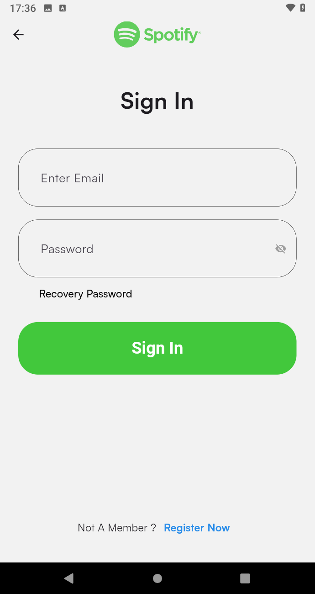
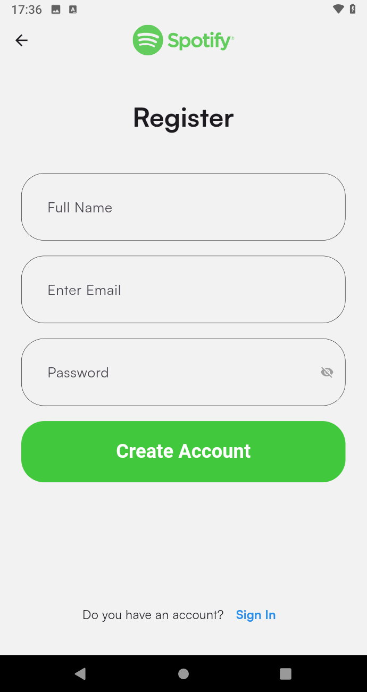
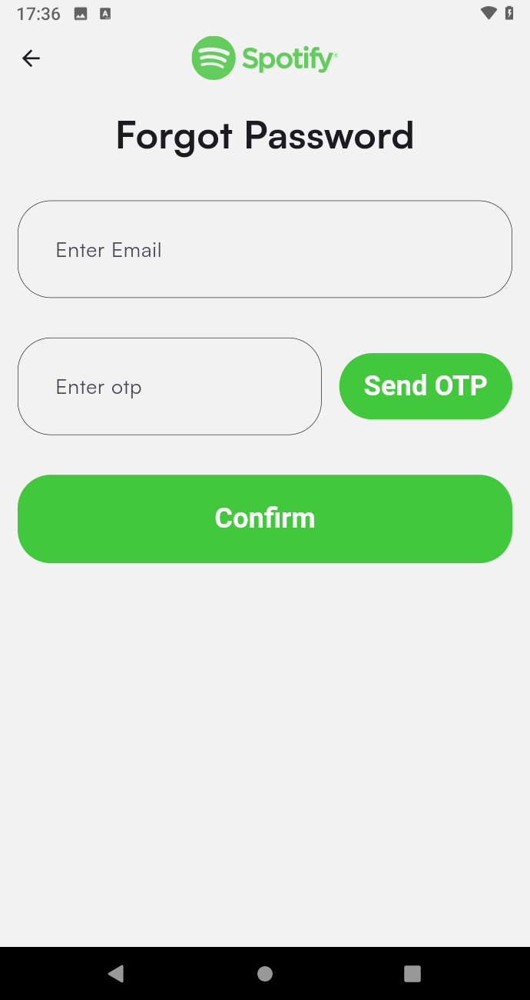
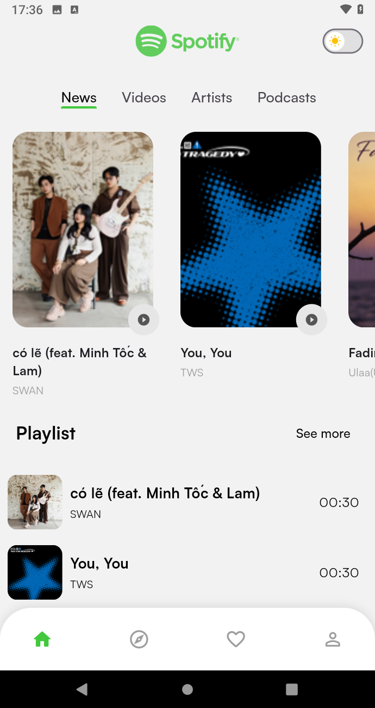
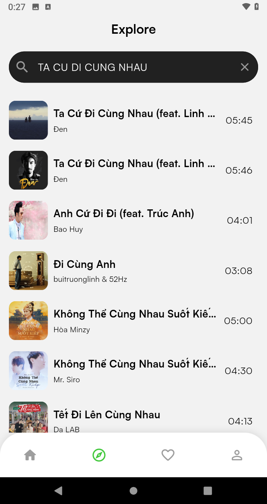
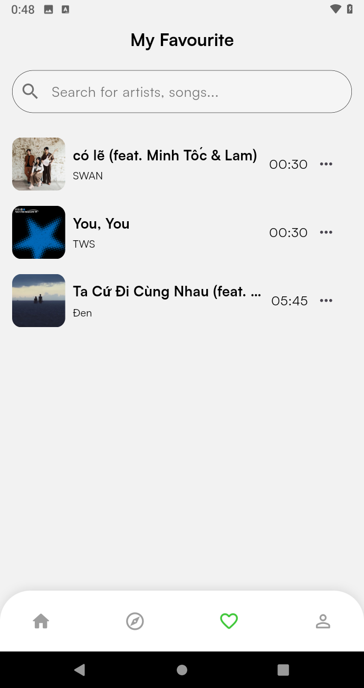
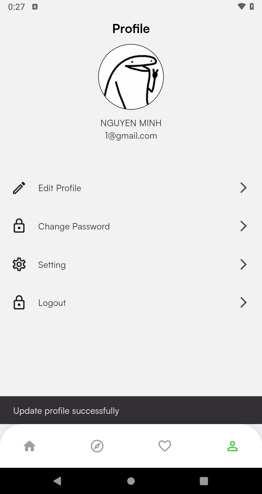

# SpotifyMe

SpotifyMe là ứng dụng nghe nhạc đa nền tảng được xây dựng bằng Flutter.  
Dự án sử dụng Clean Architecture để đảm bảo khả năng mở rộng, dễ bảo trì và dễ kiểm thử.

---

## Screenshots

<table>
  <tr>
    <td align="center">
      
    </td>
    <td align="center">
      
    </td>
    <td align="center">
      
    </td>
    <td align="center">
      
    </td>
  </tr>
  <tr>
    <td align="center">
      
    </td>
    <td align="center">
      
    </td>
    <td align="center">
      
    </td>
    <td align="center">
      
    </td>
  </tr>
</table>

---

## Architecture

Dự án tuân theo mô hình Clean Architecture với 3 layer chính:

- **Presentation**: UI, màn hình, state (BLoC/Cubit)  
- **Domain**: Business logic, use cases  
- **Data**: Data source, model, repository  

State management: `flutter_bloc`  
Dependency injection: `get_it`

---

## Technologies

- Flutter
- Dart
- flutter_bloc, hydrated_bloc
- supabase_flutter
- just_audio, audio_service
- get_it
- dartz

---

## Features

- Xác thực người dùng (đăng ký, đăng nhập, OTP)
- Phát nhạc và điều khiển playback
- Đồng bộ lyric
- Quản lý bài hát yêu thích
- UI responsive

---

## Getting Started

### Prerequisites

- Flutter SDK (>= 3.10.7)
- Dart SDK
- Supabase project

---

### Installation

```bash
git clone https://github.com/yourusername/spotify_me.git
cd spotify_me